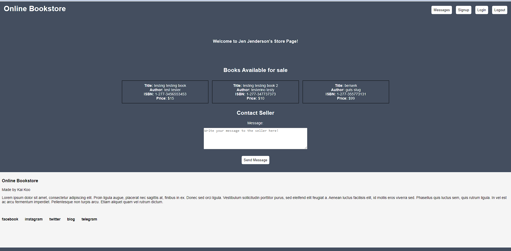

Challenge to make an online bookstore web app that allows users to seller/buy books in ~2 hours.

Uses: Express.js, Node.js, Vue.js, mySQL, as well as css, html, and client-side AJAX.

Users can see what books are advertised for sale, click the book they wish to buy, and send a message to the seller.

Only messaging is set up and the current test users are hard coded:

    1. user_id = 1 represents a buyer and they will be able to select a book for sale and send a message to the seller.

    2. user_id = 2 represents a seller and they will be able to read messages sent from a buyer about a particular book they have for sale.

Book items displayed for sale as well as messages are stored in a mySQL database. To view messages from buyer to seller, click the "Messages" button.
Other buttons like login, signup, logout, as well as links to social media are not functional, they are just placeholders for the mockup. Database queries 
on server-side express.js use prepared statements to negate SQL injection.

I have provided a "dump.sql" file which has the "bookstore" database already implemented with some sample data.

"schema_implementation.sql" and "queries.sql" can also be used to create the database.

This project requires express.js and mySQL to run.

Steps to run on unix-like system:

    1. install node.js as well as the dependencies (express, mySQL)

    2. import database into mySQL

        $ mysql < dump.sql

        or

        $ mysql < schema_implementation.sql
        $ mysql < dump.sql
    
    3. start mySQL database

        $ service mysql start

    4. start express server

        $ npm start

    

